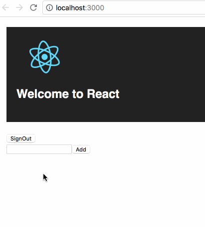

# cf-firebase-demo

A simple TodoList demo to show how to use firebase auth and firestore real-time database, prepared for Creative Friday share.

Notes about how to use Firebase, see [GitLab Time Report Chrome Extension](https://github.com/baurine/gitlab-time-report)
